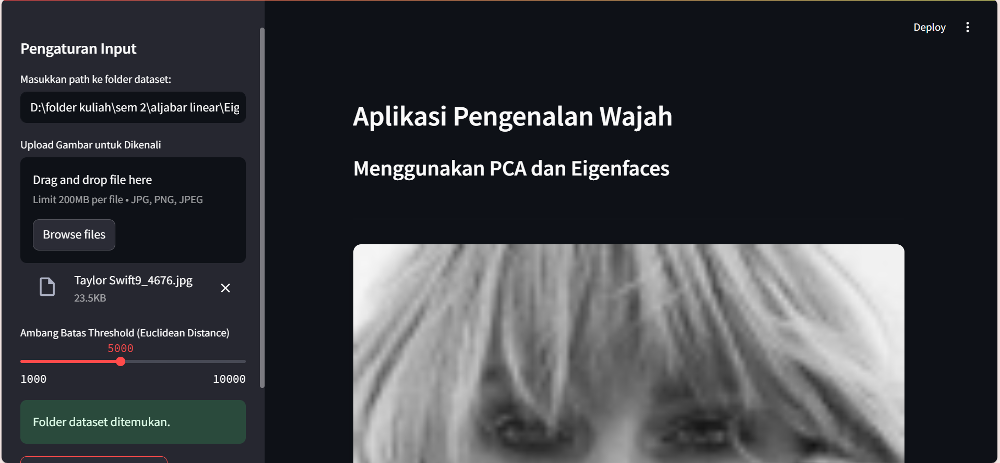
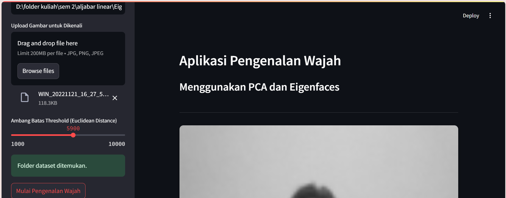
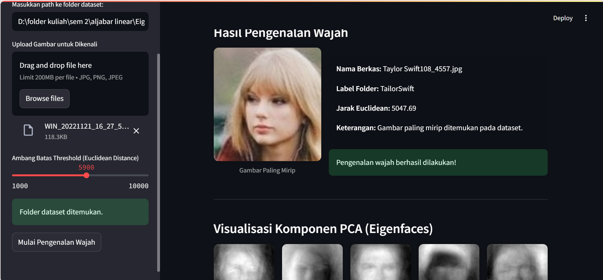
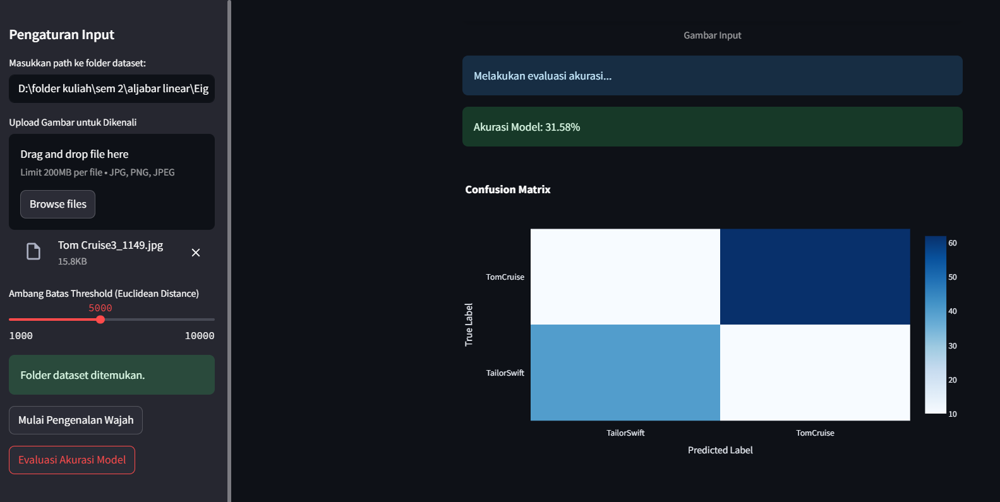
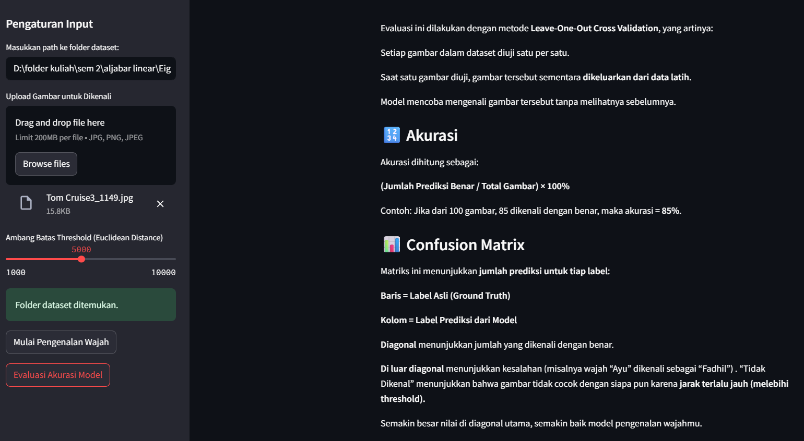

# APLIKASI-NILAI-EIGEN-DAN-EIGEN-FACE-PADA-PENGENALAN-WAJAH
PROJECT BASED LEARNING 1 ALJABAR LINEAR


Aplikasi pengenalan wajah berbasis Python yang menggunakan metode **Euclidean Distance** dan **threshold adaptif** untuk menemukan kemiripan wajah dalam dataset.

## 📌 Konsep Utama

- Awal dimulai dari threshold = 500
- Sistem membandingkan wajah input dengan data latih (dataset)
- Jika tidak ditemukan wajah dengan jarak di bawah threshold, maka threshold dinaikkan secara bertahap (misal, +500)
- Proses berulang hingga wajah yang paling mirip ditemukan, atau hingga threshold maksimum tercapai

## 🧠 Teknologi yang Digunakan

- Python
- OpenCV
- NumPy
- scikit-learn (PCA opsional)
- Streamlit (untuk antarmuka pengguna)

## 🗂️ Struktur Folder
├── __pycache__/

├── assets/

├── dataset/

├── images/

│   └── sample_result.jpg

├── dataset_loader.py

├── eigen_utils.py

├── face_recognition.py

├── gui.py

├── helpers.py

├── main.py

└── README.md

## 📄 Deskripsi File

- `dataset_loader.py` : Memuat dataset dari direktori.
- `eigen_utils.py` : Fungsi utilitas untuk perhitungan Eigenfaces.
- `face_recognition.py` : Logika utama untuk pengenalan wajah.
- `gui.py` : Antarmuka pengguna menggunakan library GUI.
- `helpers.py` : Fungsi bantu seperti normalisasi, resizing, dsb.
- `main.py` : Entry point aplikasi.
- `images/sample_result.jpg` : Contoh hasil pengenalan wajah.


## 🚀 Cara Menjalankan
1. Clone repository ini:
   ```bash
   git clone https://github.com/AyuSaniatusSholihah/APLIKASI-NILAI-EIGEN-DAN-EIGEN-FACE-PADA-PENGENALAN-WAJAH.git

2. Masuk ke 
    cd AyuSaniatusSholihah
3. Masuk ke
    cd /APLIKASI-NILAI-EIGEN-DAN-EIGEN-FACE-PADA-PENGENALAN-WAJAH/
4. Jalankan main Streamlit: 
    streamlit run main.py

## 👌Dokumentasi Program
## Input (masukkan address folder dataset dan upload gambar)


## Hasil pengenalan wajah


## Grafik nilai eigen 


## Plot vektor eigenface


## Evaluasi akurasi model


## Penjelasn evaluasi akurasi model

    
